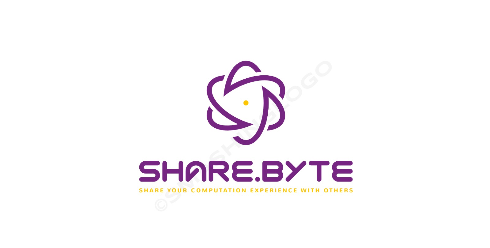

# Trabalho Final - Front-End
Dupla: Giovanna Silva Penido e João Victor Fernandes Lima

Turma: CC2MA

## Proposta
#### Nome da Aplicação: -> Share.Byte

#### Objetivo: 
-> Conectar-se em conjunto com outros estudantes afim de superar as dificuldades individuais de cada um.

-> Cada usuário terá o próprio perfil, no qual possuirá nome, foto, descrição e disciplinas de maior e menor dificuldades. Dessa forma a aplicação tem o objetivo de realizar uma filtragem, interligando os alunos para que estes se ajudem. 

-> Exemplo prático: Giovanna preenche seu perfil com dificuldade em Cálculo, e, João, o dele com facilidade nessa matéria. O sistema irá enviar o perfil de João para Giovanna, indicando que eles tiveram uma conexão e que podem iniciar contato. 

